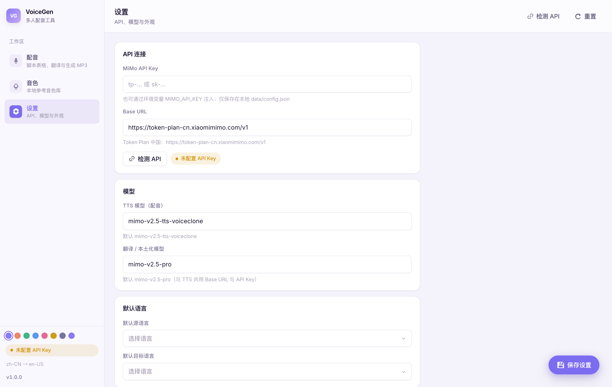
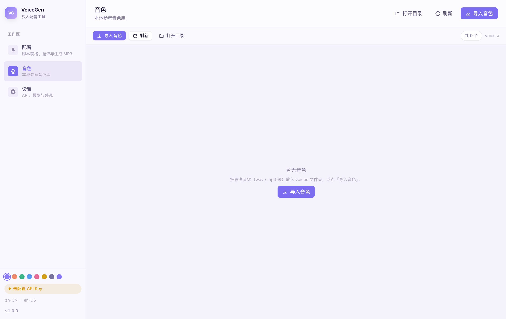
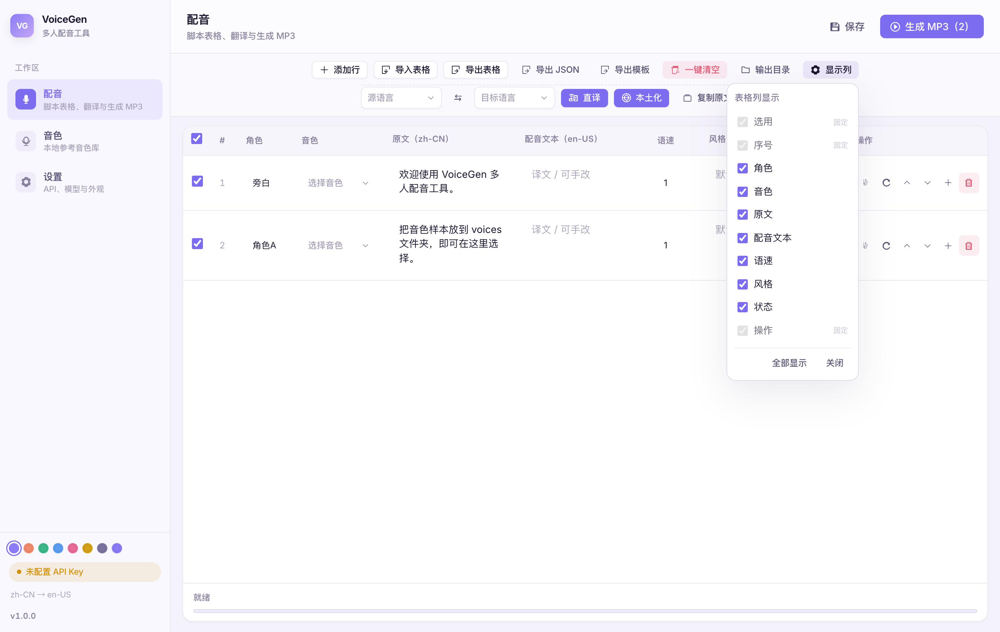
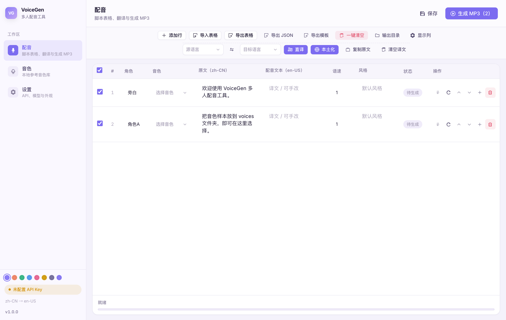
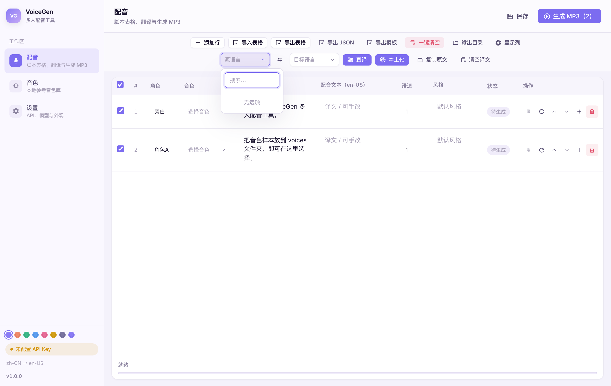
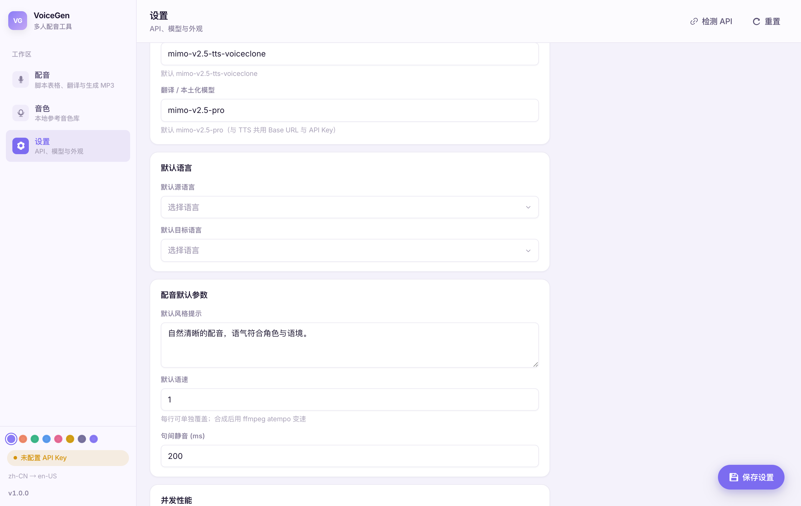
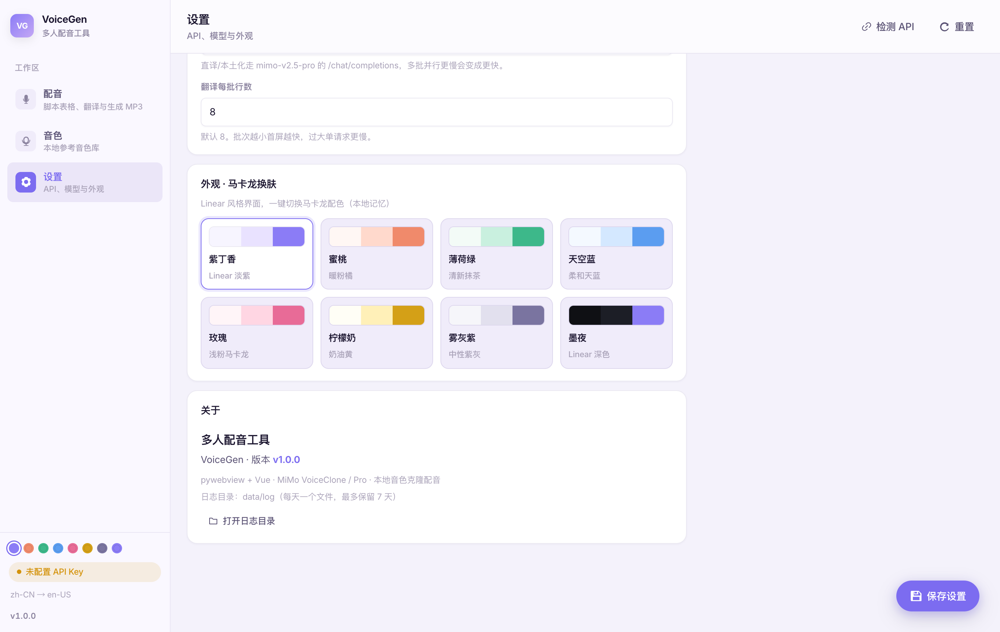
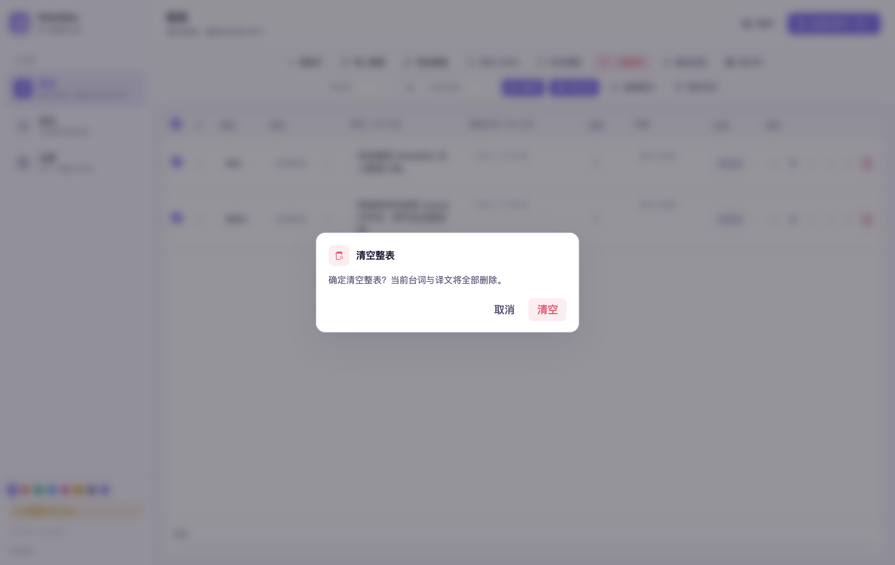

# 多人配音工具 · 分步图文教程

> 版本：**v1.0.0**  
> 界面截图来自应用真实 UI（示意数据）  
> 仓库：https://github.com/shukeCyp/VoiceGen

本教程按「从安装到导出 MP3」的真实操作顺序编写。每一步对应软件里的具体按钮与面板。

---

## 目录

1. [界面总览](#1-界面总览)
2. [设置 API（必须）](#2-设置-api必须)
3. [管理音色](#3-管理音色)
4. [在配音页编辑台词](#4-在配音页编辑台词)
5. [导入 / 导出表格](#5-导入--导出表格)
6. [显示或隐藏表格列](#6-显示或隐藏表格列)
7. [翻译：直译与本土化](#7-翻译直译与本土化)
8. [生成整轨 MP3](#8-生成整轨-mp3)
9. [单条试听与重新生成](#9-单条试听与重新生成)
10. [其它设置与日志](#10-其它设置与日志)
11. [常见问题](#11-常见问题)

---

## 1. 界面总览

启动软件后，主界面分为：

| 区域 | 作用 |
|------|------|
| **左侧导航** | 切换「配音 / 音色 / 设置」三个页面 |
| **顶部标题栏** | 当前页名称 + 右侧主操作按钮（如「生成 MP3」） |
| **中间工作区** | 表格 / 音色列表 / 设置表单 |
| **底部状态栏** | 进度、完成信息 |


**怎么用**

1. 点左侧 **配音**：写台词、翻译、生成  
2. 点 **音色**：导入参考音频、试听、删除  
3. 点 **设置**：填 API Key、调并发、换肤  

左下角有：

- API 状态角标（就绪 / 失败）  
- 当前语言方向（如 简体中文 → English）  
- 版本号 `v1.0.0`  
- 马卡龙主题色点（可一键换肤）  

---

## 2. 设置 API（必须）

**入口**：左侧 → **设置**



### 2.1 填写密钥

| 字段 | 说明 |
|------|------|
| **MiMo API Key** | Token Plan 密钥，一般以 `tp-` 开头 |
| **Base URL** | 默认 `https://token-plan-cn.xiaomimimo.com/v1`，一般不用改 |

### 2.2 检测是否可用

1. 点 **检测 API**  
2. 成功时角标显示 **TTS+LLM 就绪**  
3. 右下角悬浮按钮 **保存设置** 点一下（必点，否则重启可能丢改动）  

### 2.3 模型分别干什么

| 字段 | 模型 | 用途 |
|------|------|------|
| TTS 模型 | `mimo-v2.5-tts-voiceclone` | **生成配音**（克隆音色） |
| 翻译 / 本土化模型 | `mimo-v2.5-pro` | **直译 / 本土化**（改文字，不生成声音） |

> 启动时如果已经保存过 Key，会**自动检测**一次，无需每次手动点。

---

## 3. 管理音色

**入口**：左侧 → **音色**



### 3.1 导入音色

有两种方式：

1. 点工具栏 **导入音色**，在文件对话框里选 wav/mp3 等  
2. 直接把音频文件复制到程序目录下的 `voices/` 文件夹，再点 **刷新**  

**规则**：文件名去掉扩展名 = 音色名。  
例如 `Alex.mp3` → 下拉框里显示 **Alex**。

### 3.2 试听参考音

操作列第一个按钮（耳机图标）：

- 点一下：**播放** 该音色文件  
- 再点一下：**暂停**  
- 点另一条会自动停掉当前播放  

### 3.3 删除音色

点 **删除**，会弹出确认框，确认后从 `voices/` 移除文件。

### 3.4 打开目录

点 **打开目录**，用系统文件管理器打开 `voices/`，方便批量拷贝。

---

## 4. 在配音页编辑台词

**入口**：左侧 → **配音**

回到主界面（见第 1 节截图）。

### 4.1 表格每一列做什么

| 列 | 怎么用 |
|----|--------|
| **选用**（勾选） | 勾上的行才会参与「生成 / 翻译」 |
| **#** | 行号 |
| **角色** | 显示名，如「甲」「旁白」 |
| **音色** | 下拉选择 `voices/` 里的音色 |
| **原文** | 源语言台词 |
| **配音文本** | 真正拿去 TTS 的文本；翻译结果写这里；为空则用原文 |
| **语速** | 如 `1.0`、`1.05`（合成后 ffmpeg 变速） |
| **风格** | 可选，给 TTS 的风格提示（支持多行） |
| **状态** | 待生成 / 生成中 / 完成 / 失败 |
| **操作** | 试听、重新生成、上下移、插入、删除 |

### 4.2 添加 / 调整行

工具栏：

- **添加行**：表格末尾加一行  
- 操作列 **+**：在当前行下方插入  
- **↑ / ↓**：移动行顺序（生成 MP3 时按表顺序拼接）  
- **×**：删除该行  

### 4.3 全选

表头最左侧勾选框 = **全选 / 取消全选** 所有行的「选用」。

---

## 5. 导入 / 导出表格

工具栏按钮（中文）：

| 按钮 | 功能 |
|------|------|
| **导入表格** | 从本机选 CSV/JSON 导入台词 |
| **导出表格** | 导出当前表（中文表头 CSV） |
| **导出 JSON** | 导出 JSON 格式 |
| **导出模板** | 导出空白示例表，方便填完再导入 |
| **一键清空** | 清空整表（有确认框） |

### 5.1 表头格式（中文）

```text
角色,音色,原文,配音文本,语速,风格,启用
```

导入也兼容英文表头：`speaker,voice,text,tts_text,speed,style,enabled`。

### 5.2 推荐流程

1. 先点 **导出模板**  
2. 用 Excel / 记事本填台词  
3. **导入表格** 读回来  
4. 再在界面里选音色、调语速  

---

## 6. 显示或隐藏表格列

窗口较小时，「语速」等列容易被挤窄。

1. 点工具栏 **显示列**  
2. 勾选/取消各列  
3. 选项会**自动记住**，下次打开同样  



**固定列**（不能关）：选用、序号、操作。  
**可隐藏**：角色、音色、原文、配音文本、语速、风格、状态。  

> 原文与配音文本至少会保留一列，避免表格只剩空壳。

---

## 7. 翻译：直译与本土化

工具栏第二行是语言与翻译区：



### 7.1 选语言

1. 左侧下拉：**源语言**（原文语言）  
2. 中间 **交换** 按钮：源/目标对调  
3. 右侧下拉：**目标语言**（希望配音的语言）  



下拉支持**搜索**（不是系统原生下拉框）。

### 7.2 直译

- 按钮：**直译**  
- 调用：**`mimo-v2.5-pro`** → `POST {Base URL}/chat/completions`  
- 结果：写入「配音文本」列  
- 行为：分批并发翻译，**每批完成就立刻更新界面**  

### 7.3 本土化

- 按钮：**本土化**  
- 同样走 `mimo-v2.5-pro`  
- 更偏目标市场口语、文化表达，不是字对字  

### 7.4 其它

| 按钮 | 作用 |
|------|------|
| **复制原文** | 把原文整列复制到配音文本（不调 API） |
| **清空译文** | 清空所有配音文本 |

源语言 = 目标语言时：直译不会调 API，直接复制原文。

---

## 8. 生成整轨 MP3

### 8.1 生成前检查

- [ ] API 已就绪  
- [ ] 需要的行已勾选「选用」  
- [ ] 每行选了音色  
- [ ] 有原文或配音文本  

### 8.2 开始生成

1. 点右上角 **生成 MP3（N）**（N = 可生成行数）  
2. 底部进度条显示并发进度（默认多线程）  
3. 完成后底部显示输出路径，文件在 `output/`  

### 8.3 并发参数（可选）

**设置 → 并发性能**：



| 参数 | 含义 |
|------|------|
| TTS 并发生成线程数 | 同时请求几条配音（默认 4） |
| 翻译并发线程数 | 同时跑几批翻译 |
| 翻译每批行数 | 每批发给大模型多少句 |

改完后记得 **保存设置**。

### 8.4 取消

生成过程中右上角会出现 **取消**，可中断任务。

---

## 9. 单条试听与重新生成

在配音表 **操作** 列：

| 图标/按钮 | 功能 |
|-----------|------|
| 耳机 | 试听本条已生成的音频（需状态为「完成」） |
| 刷新 | **只重做这一条**，不重新合并整轨 MP3 |
| ↑ ↓ | 移动顺序 |
| + | 下方插入行 |
| 删除 | 删行 |

流程建议：

1. 先 **生成 MP3** 或对单行 **刷新**  
2. 点耳机试听  
3. 不满意改文本/语速后再单条重做  
4. 全部 OK 后再点一次「生成 MP3」导出完整成片  

---

## 10. 其它设置与日志

### 10.1 主题

设置页可切换马卡龙主题；也可点左侧导航底部色点。  
主题会记住，下次打开自动恢复。

### 10.2 关于与日志



- 显示版本号  
- **打开日志目录** → `data/log/`  
- 日志文件名：`voicegen-YYYY-MM-DD.log`  
- **每天一个，最多保留 7 天**  
- 含 API、翻译、TTS 每行、ffmpeg、界面操作等  

### 10.3 确认对话框

危险操作（如清空整表、删除音色）会弹出**应用内对话框**，不是系统原生弹窗：



- **取消**：关闭  
- **清空 / 删除**：执行  

---

## 11. 常见问题

| 问题 | 处理 |
|------|------|
| 检测 API 失败 / `WinError 10061` | 检查网络；关闭未启动的系统代理；确认 Base URL |
| 进度条中文乱码 | 更新到最新版 |
| 没有 ffmpeg | 用官方打包的 exe（已内置）；开发环境可运行 `python scripts/download_ffmpeg_windows.py` |
| 语速列被挤没 | 用「显示列」隐藏其它列，或拉大窗口 |
| 翻译很慢 | 正常：走大模型；可调「翻译并发 / 批大小」 |
| 生成失败 | 打开 `data/log` 看当天日志 |

---

## 附录：推荐完整流程（四人多音色）

1. **设置** 里填 Key → 检测 → 保存  
2. **音色** 导入 4 个参考音 → 试听确认  
3. **配音** 导入表格或粘贴台词  
4. 每行选对应音色  
5.（可选）选目标语言 → 直译 / 本土化  
6. 全选 → **生成 MP3**  
7. 试听不满意的行 → 单条重新生成  
8. 再到 `output/` 取最终文件  

---

*截图由教程脚本自动采集自当前 UI；若界面有小幅改版，以你本机软件为准。*
